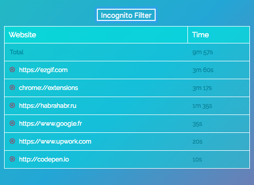
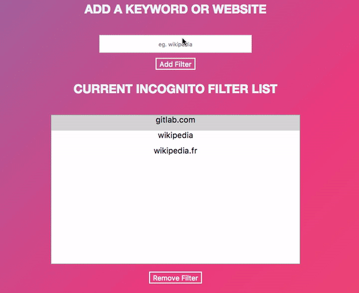

# Google Chrome Extension : WebOWL
[](https://akinariobi.github.io/webowl/)
[](http://codepen.io/pinto165/pen/pyBNzX)
[](https://fonts.google.com/specimen/Raleway)
[](https://github.com/akinariobi/chrome-web-owl/blob/master/webowl.zip)

Time tracker and Incognito Filter
_________________________________

##### Popup window screen

##### Incognito filter demo

##### Popup window demo


## Files 

```javascript
 chrome-web-owl
  |
  |________ incognito : incognito filter files 
  |
  |________ time : time tracker files
  |
  |________ images : icons for this extension
  |
  |________ style : css files 
  |
  |_____ manifest.json
  |
  |_____ webowl.zip 
```
